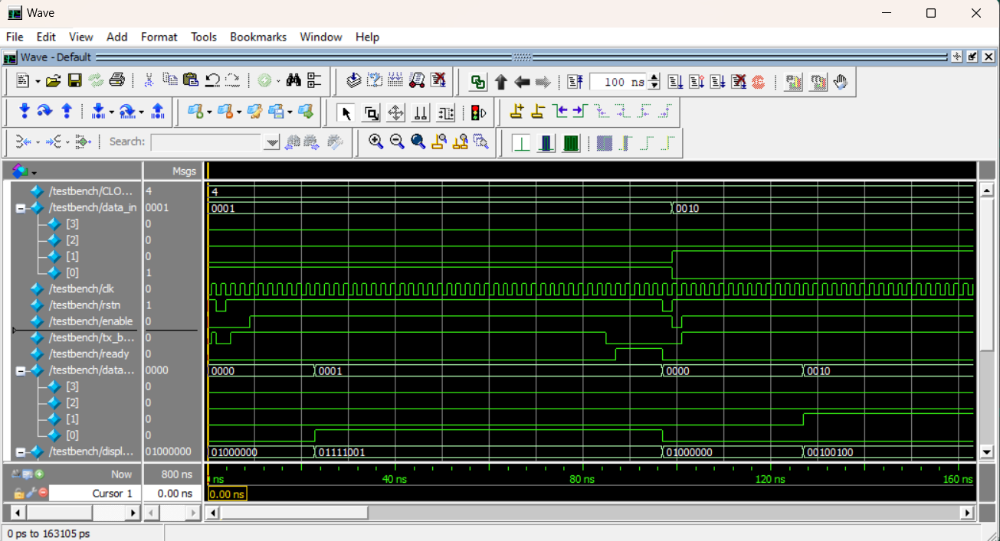

# UART Transceiver Implementation for FPGA

This project was conducted as part of the EN2111 Electronic Circuit Design module at the Department of Electronic and Telecommunication Engineering, University of Moratuwa.

## Overview
A UART communication link was established between two FPGA boards. The functionality was verified by transmitting binary numbers as inputs and displaying them on a 7-segment display connected to the receiver FPGA board.

## Repository Contents
- **Quartus_Prime_Project_Directory**: Contains the full project files, including directories related to the UART assignment.
- **src**: Includes basic SystemVerilog files for the project.
  - `transmitter.sv`: Contains code for the transmitter module.
  - `receiver.sv`: Contains code for the receiver module.
  - `testbench.sv`: Testbench for simulation.
  - `binary_to_7seg.sv`: Code for converting binary numbers to 7-segment display format.
  - `uart.sv`: Full UART implementation.
- **docs**: Contains the project report and assignment details.

## Simulation Using Quartus and ModelSim

For detailed instructions on setting up and simulating a project using Quartus Prime 20.1.1 and ModelSim, please refer to the [provided PDF document](docs/Simulation%20Using%20Quartus%20and%20ModelSim.pdf).

## FPGA Implementation Diagram

## Timing Diagram

